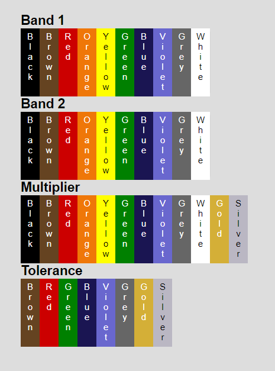

# Resistor

Simple interactive calculator that should help you find the resistance in ohms based on a resistor's colors.

## How to use

When you first load the page, the calculator will hold the following default values:

`To use, simply choose a color by clicking on the color option of interest.`

` The first two bands set the significant figures and thus share the same 10 options. The multiplier has a few extra options because it denotes the scale. Finally, the last color is the Tolerance, which is the deviation from the nominal value.`

**For example:** choosing color _Green_ from **Band 1**, _Red_ from **Band 2**, _Orange_ from **Multiplier**, and finally _Brown_ from the **Tolerance** section yields the following output:

